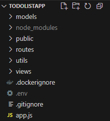

# ToDoListApp

## Installation

- Cloner le projet en local
- Ajouter un fichier .env avec le code ci-dessous


```
HOST = 'Serveur SMTP' (ex: smtp.office365.com #SMTP server for Microsoft 365)
USER = 'Adresse mail'
PASS = 'Mot de passe de l'adresse email'
SERVICE = 'Service de l'email' (ex: Outlook365 pour microsoft365)
BASE_URL = 'Adresse ip ou nom de domaine de l'application'
```
-  Avec docker, lancer en ligne de commande ces deux lignes à la suite :

```
docker build -t todolist-app .
docker run -p 3000:3000 todolist-app
```